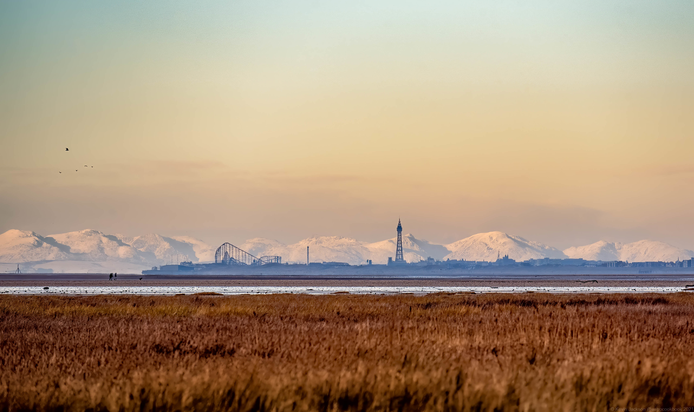
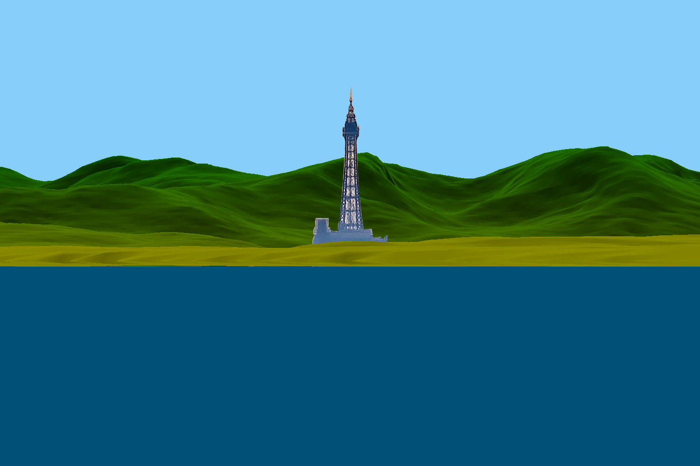
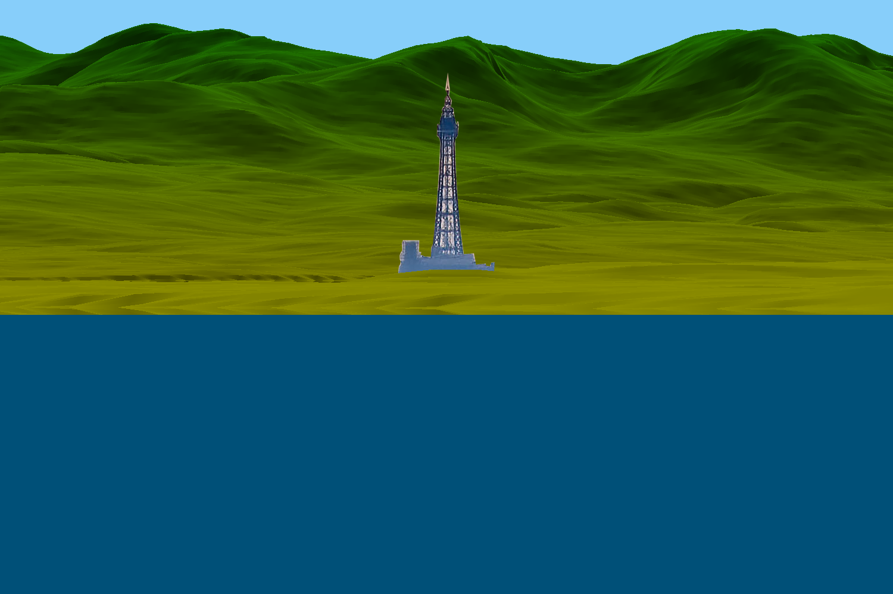

:orphan:

.. _blackpool_tower-label:

Black Pool Tower In Front of Moutains
-------------------------------------

back to :ref:`examples`

In this example we try to model an image of Blackpool tower are a remarkably clear day. The day is so clear that you can easily see the moutains in the background which are significantly farther away. 

:download:`download files <../../examples/zips/blackpool_ferriswheel.zip>`

.. literalinclude:: ../../examples/zips/blackpool_tower/blackpool_tower.py
	:linenos:
	:language: python
	:lines: 1-

This image is nice because it shows the large moutains so clearly. It is clear that at those distances the curvature of the earth should provide a significant amount of drop. Here we will use topography data to generate a model with standard atmosphere on a spherical and flat earth. 

The Image in question is presented above and the models are presented below:

Spherical Earth:

Flat Earth:

