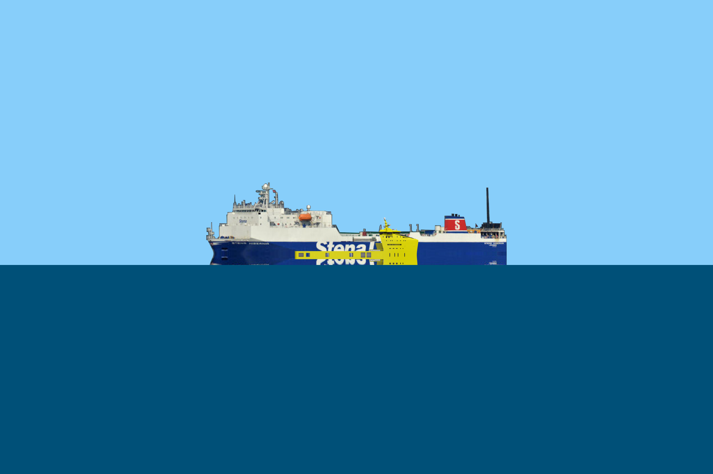

.. _inferior_mirage-label:

Simulation of an Inferior Mirage
--------------------------------

In this example we show how to render an inferior mirage. 

:download:`download files <../../examples/zips/inferior_mirage.zip>`

.. literalinclude:: ../../examples/zips/inferior_mirage/inferior_mirage.py
	:linenos:
	:language: python
	:lines: 1-

Here is a result of rendering:

Compare this to an image taken by a Youtuber named Ranty Flat Earth:

Thanks Ranty for showing the earth is NOT flat!
