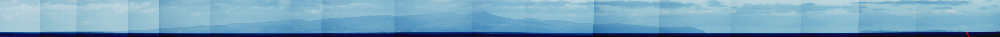
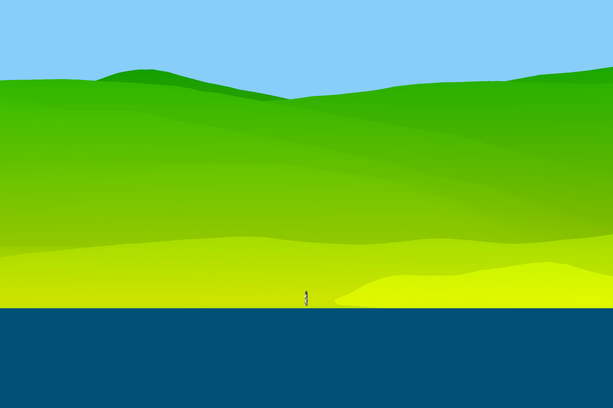

.. _isle_of_man-label:

Isle of Man modeling
--------------------

A Youtuber by the name of Sleeping Warrior has taken it apon himself to prove that the earth is flat. In doing so he has made many observations of distance objects over water, all of which have demonstrated the curvature of the earth. Here we will discuss a particular observation which was done from a beach at a small town called St. Bees in the UK. This area has a lot of hills and cliffs close to the Irish sea in which there is an island called the Isle of Man. This island has some very distinct features which and a varying land profile which we will explore in this example. 

We have downloaded some elevation data from the SRTM mission which covers the entire Isle of Man and we will show how to use this to create a render of that topographical data with refraction:

:download:`download files <../../examples/zips/isle_of_man.zip>`

.. literalinclude:: ../../examples/scripts/isle_of_man.py
	:linenos:
	:language: python
	:lines: 1-

Results
-------

Here is a a composite which was composed out of a video panning across the Isle of Man:

Compare this to the rendered version of the composite, here we have tried to guess the correct temperature profile for the inferior mirage.

Another interesting thing to look at on the Island is Maughold lighthouse which stimluated much debate as some have argued that it should not be able to be seen from the location where Sleeping Warrior took his video. However we have modeled the lighthouse in its correct position and it turns out that because of the refraction, the light house is actually being very slightly loomed up. Yet another brilliant observation by Mr. Sleeping Warrior proving the Earth is a globe!

